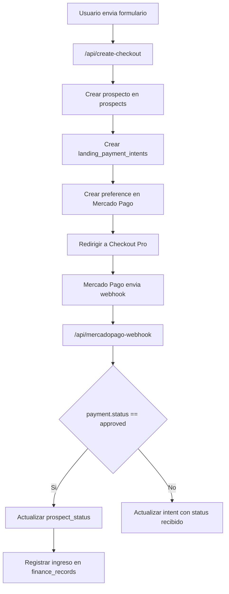

# Mercado Pago Produccion - Landing Venezia 3.0

## Variables locales

Colocar en `/Users/venezia1/Documents/Landing Page/.env.local`:

```bash
SUPABASE_URL=...
SUPABASE_ANON_KEY=...
SUPABASE_SERVICE_ROLE_KEY=

MERCADOPAGO_ACCESS_TOKEN=APP_USR-...
MERCADOPAGO_PUBLIC_KEY=APP_USR-...
MERCADOPAGO_WEBHOOK_SECRET=

LANDING_BASE_URL=https://url-publica-de-la-landing
MERCADOPAGO_WEBHOOK_URL=https://url-publica-de-la-landing/api/mercadopago-webhook
```

Notas:

- `MERCADOPAGO_ACCESS_TOKEN` es privado y solo lo usan `/api/create-checkout` y `/api/mercadopago-webhook`.
- `MERCADOPAGO_PUBLIC_KEY` queda configurado para uso futuro con SDK frontend. El checkout actual usa redireccion a Checkout Pro.
- En pruebas locales, `LANDING_BASE_URL` debe ser una URL publica de LocalTunnel, no `localhost`.
- `MERCADOPAGO_WEBHOOK_SECRET` se copia desde Mercado Pago despues de registrar el webhook.

## Variables en Vercel

Agregar en el proyecto `landing-page-venezia-3`:

```bash
npx --yes vercel env add SUPABASE_URL production
npx --yes vercel env add SUPABASE_ANON_KEY production
npx --yes vercel env add SUPABASE_SERVICE_ROLE_KEY production
npx --yes vercel env add MERCADOPAGO_ACCESS_TOKEN production
npx --yes vercel env add MERCADOPAGO_PUBLIC_KEY production
npx --yes vercel env add MERCADOPAGO_WEBHOOK_SECRET production
npx --yes vercel env add LANDING_BASE_URL production
npx --yes vercel env add MERCADOPAGO_WEBHOOK_URL production
```

Valores de produccion esperados:

```bash
LANDING_BASE_URL=https://landing-page-venezia-3.vercel.app
MERCADOPAGO_WEBHOOK_URL=https://landing-page-venezia-3.vercel.app/api/mercadopago-webhook
```

No hacer deploy hasta aprobar pruebas locales.

## Migracion Supabase requerida

Ejecutar en Supabase SQL Editor:

```bash
/Users/venezia1/Documents/Landing Page/supabase/20260613_landing_payment_tables.sql
```

La migracion crea:

- `landing_payment_intents`
- `mercadopago_webhook_events`

## Flujo implementado



## Productos

- Apartado: `$399 MXN`
- Inscripcion completa: `$999 MXN`

## URLs de retorno

El endpoint genera automaticamente:

- `success`: `{LANDING_BASE_URL}/?payment_status=success&intent_id={intentId}`
- `pending`: `{LANDING_BASE_URL}/?payment_status=pending&intent_id={intentId}`
- `failure`: `{LANDING_BASE_URL}/?payment_status=failure&intent_id={intentId}`

## Registrar webhook en Mercado Pago

1. Entrar a Mercado Pago Developers.
2. Ir a `Tus integraciones`.
3. Seleccionar la app productiva.
4. Ir a `Webhooks` o `Notificaciones`.
5. Agregar URL modo produccion:

```text
https://landing-page-venezia-3.vercel.app/api/mercadopago-webhook
```

6. Activar evento `Pagos` / topic `payment`.
7. Guardar.
8. Copiar la clave secreta generada y colocarla en `MERCADOPAGO_WEBHOOK_SECRET`.

Para pruebas locales con LocalTunnel, usar temporalmente:

```text
https://TU-SUBDOMINIO.loca.lt/api/mercadopago-webhook
```

## Prueba local

```bash
cd "/Users/venezia1/Documents/Landing Page"
npx --yes vercel dev --listen 0.0.0.0:5173
npx --yes localtunnel --port 5173
```

Con la URL de LocalTunnel:

```bash
LANDING_BASE_URL=https://TU-SUBDOMINIO.loca.lt
MERCADOPAGO_WEBHOOK_URL=https://TU-SUBDOMINIO.loca.lt/api/mercadopago-webhook
```

Enviar el formulario y confirmar respuesta de `/api/create-checkout`:

- `prospectId`
- `intentId`
- `preferenceId`
- `checkoutUrl`
